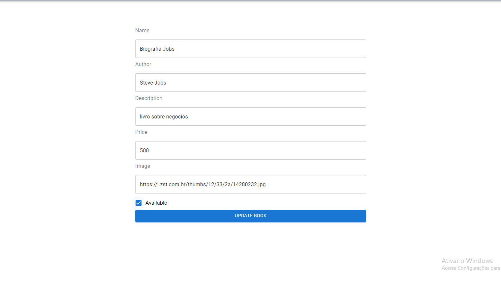

## 📚 Sistema de Livros

### Aplicação que permite qualquer usuário postar um livro de seu interesse especificando o autor,nome,descrição,colocando alguma imagem e inserindo o preço do mesmo. 
### Após publicado esse livro é salvo e exibido para todos os usuários, também existe a possibilidade de atualizar as informações do livro ou até apagar o mesmo. 

## 🖥️ Algumas Telas Do Projeto

## 💻 Tecnologias Usadas

 

## Instalação 

#### Clone o Projeto Com:  

git clone https://github.com/JoaoRicardo2005/bookstore-frontend
#### Entre na pasta e instale as dependências com: 
 Yarn
#### Com tudo correto você pode iniciar o servidor com:
yarn start
#### Se você estiver no ambiente de desenvolvimento, poderá usar o servidor de desenvolvimento:
yarn dev 
yarn queue
## Importante 💛

### a aplicação foi totalmente feita por mim joão ricardo mas você pode usar ela do jeito que preferir! seja para estudo,apoio nos estudos ou até para ganhar dinheiro quem sabe rsrs. entre em contato em joaobarbanti7@gmail.com.

